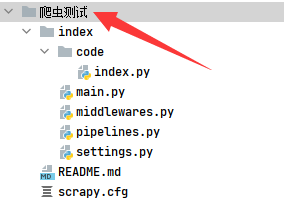

# Scrapy爬虫框架，极简demo中文案例

       

最近研究爬虫框架，各种乱七八糟问题，和爬小项目没必要交互

于是研究了一下Scrapy框架，将其简化，删除对爬小项目无用功能文件

##  优点
精简版，删除无用功能文件，莫名其妙的交互

项目名均为通用昵称例如（index、main），可反复导入只需修改目录名即可，如图：

##  技术特性

- [x] **无需通过cmd创建，直接导入**
- [x] **基础配置已搭建完毕，无需重新配置**
- [x] **中文注解**
- [x] **无需命令行，直接运行：main.py**

## 联系

微信公众号：小千哥

公众号时常分享前沿黑科技代码、思路，欢迎关注！